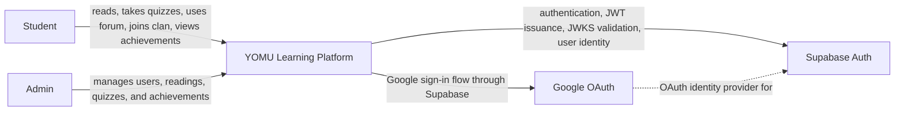
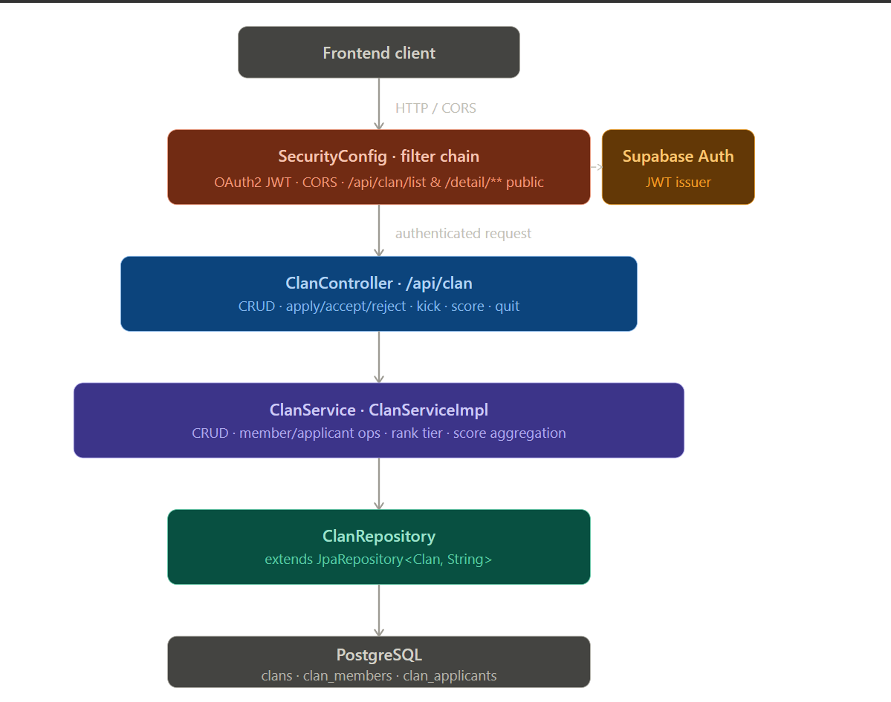
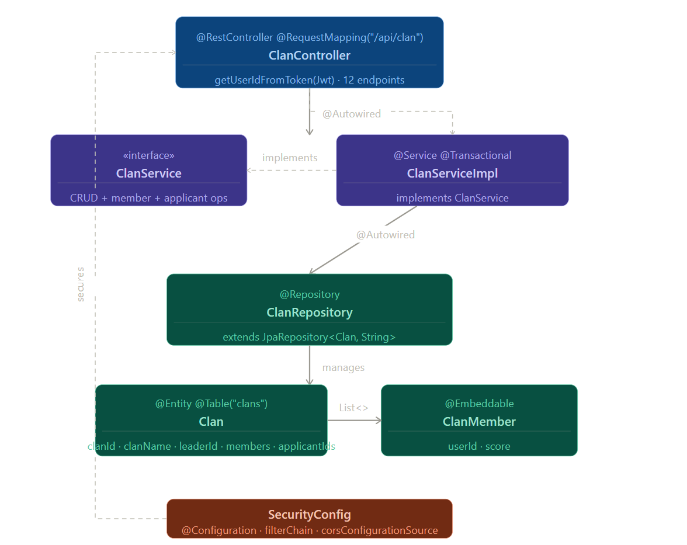

# Module 9: Visualizing Software Architecture - YOMU

Dokumen ini menjelaskan arsitektur YOMU dalam kondisi saat ini (_current architecture_) menggunakan pendekatan C4 Model. Fokusnya adalah memahami bentuk sistem, aktor yang memakai sistem, container utama, relasi antarservice, dan deployment awal yang tergambar dari repository serta diagram yang tersedia.

## 1. Current Architecture of YOMU

YOMU adalah platform pembelajaran membaca berbasis web. Secara arsitektur, YOMU dibangun sebagai aplikasi frontend Next.js yang berkomunikasi dengan beberapa backend Spring Boot. Backend dipisahkan berdasarkan domain fitur sehingga setiap service memiliki tanggung jawab yang relatif jelas.

| Bagian           | Teknologi                                           | Tanggung jawab utama                                                                                 |
| ---------------- | --------------------------------------------------- | ---------------------------------------------------------------------------------------------------- |
| `frontend`       | Next.js, React, TypeScript                          | UI web untuk admin dan student, routing halaman, session cookie, dan sebagian proxy request backend. |
| `be-auth`        | Spring Boot, Supabase Auth, PostgreSQL/Supabase DB  | Login, register, refresh token, logout, profil user, role admin/student, dan validasi identitas.     |
| `be-bacaan`      | Spring Boot, PostgreSQL                             | Bacaan, quiz, progress membaca, submit quiz, dan integrasi event quiz selesai ke achievement.        |
| `be-forum`       | Spring Boot, PostgreSQL, Supabase JWT/JWKS          | Forum message, reply, reaction, dan validasi write operation dengan token Supabase.                  |
| `be-liga`        | Spring Boot, Supabase JWT/JWKS, Supabase PostgreSQL | Clan/liga, member, application, join/quit clan, dan validasi user berbasis token Supabase.           |
| `be-achievement` | Spring Boot, PostgreSQL                             | Achievement, daily mission, student progress, featured achievement, dan event `quiz-completed`.      |
| Supabase Auth    | External service                                    | Identity provider, JWT issuer, JWKS provider, dan integrasi Google SSO.                              |
| Google OAuth     | External service                                    | Provider login Google yang digunakan melalui Supabase.                                               |

Arsitektur ini dapat dipahami sebagai **modular backend / microservice sederhana**. Pemisahan domain sudah terlihat dari folder dan service: auth, bacaan, forum, liga, dan achievement. Setiap service memiliki API sendiri dan database/domain data sendiri. Keuntungan pendekatan ini adalah domain lebih mudah dipahami dan ownership fitur lebih jelas. Trade-off-nya adalah integrasi antarservice dan konfigurasi deployment menjadi lebih kompleks dibanding aplikasi monolitik.

Beberapa karakter penting dari arsitektur saat ini:

- Frontend menjadi entry point utama untuk student dan admin.
- Auth dan forum sudah memiliki pola akses yang lebih terkontrol melalui Next.js API route/proxy.
- Bacaan dan liga pada beberapa bagian frontend masih terlihat dipanggil langsung menggunakan URL service lokal seperti `localhost:808x`.
- Supabase dipakai sebagai pusat identitas melalui JWT/JWKS.
- `be-bacaan` memiliki integrasi ke `be-achievement` ketika quiz selesai, sehingga achievement dapat diperbarui berdasarkan aktivitas student.
- Setiap domain utama memiliki database PostgreSQL sendiri atau koneksi PostgreSQL yang dipisahkan secara logis.

## 2. System Context Diagram

System Context Diagram melihat YOMU sebagai satu software system utuh. Diagram ini menunjukkan siapa pengguna YOMU dan external system apa yang langsung relevan terhadap sistem.

### Penjelasan Context Diagram

Pada level context, YOMU diposisikan sebagai sistem utama yang memberikan nilai ke dua jenis pengguna: student dan admin. Student menggunakan sistem untuk aktivitas pembelajaran, sedangkan admin menggunakan sistem untuk mengelola data dan fitur pembelajaran.

| Elemen                 | Jenis                    | Analisis                                                                                                                                                                                                                                        |
| ---------------------- | ------------------------ | ----------------------------------------------------------------------------------------------------------------------------------------------------------------------------------------------------------------------------------------------- |
| Student                | Person                   | Pengguna utama. Student membaca bacaan, mengerjakan quiz, melihat progress, memakai forum, bergabung ke clan, dan melihat achievement. Availability fitur student penting karena alur belajar bergantung pada beberapa backend sekaligus.       |
| Admin                  | Person                   | Pengguna pengelola sistem. Admin membutuhkan akses ke fitur administrasi seperti pengelolaan bacaan, quiz, user, achievement, dan konfigurasi konten. Security pada akses admin menjadi aspek penting karena dampaknya langsung ke data sistem. |
| YOMU Learning Platform | Software System          | Sistem yang dikembangkan oleh kelompok. Pada level context, seluruh frontend dan backend dianggap sebagai satu sistem karena semuanya bersama-sama membentuk pengalaman YOMU.                                                                   |
| Supabase Auth          | External Software System | Komponen eksternal paling penting untuk identitas. Supabase menerbitkan token, menyediakan JWKS untuk validasi token, dan menjadi dasar otorisasi bagi beberapa backend, termasuk `be-liga`.                                                    |
| Google OAuth           | External Software System | Provider login eksternal. Dalam arsitektur ini, Google OAuth bukan dipanggil sebagai service domain bisnis, tetapi sebagai bagian dari alur autentikasi melalui Supabase.                                                                       |

## 3. Container Diagram

Diagram ini memperlihatkan container utama di dalam YOMU, relasi antarcontainer, dan database yang digunakan masing-masing domain.

### Penjelasan Container Diagram

Container diagram menunjukkan bahwa YOMU tidak hanya terdiri dari satu aplikasi backend. Sistem ini terbagi menjadi frontend Next.js dan beberapa backend Spring Boot yang berkomunikasi lewat REST API.

| Container               | Peran                            | Analisis                                                                                                                                                                                                                                                    |
| ----------------------- | -------------------------------- | ----------------------------------------------------------------------------------------------------------------------------------------------------------------------------------------------------------------------------------------------------------- |
| Single Page Application | UI utama untuk admin dan student | Container ini adalah pintu masuk semua user. Admin dan student mengakses aplikasi melalui browser menggunakan HTTPS. Frontend bertugas menampilkan UI dan mengirim request ke backend domain yang sesuai.                                                   |
| Authentication          | Service auth dan profile user    | Service ini menangani autentikasi user, data profil, dan role. Karena service lain membutuhkan identitas user, auth menjadi komponen penting untuk security dan user management.                                                                            |
| Bacaan                  | Service bacaan dan quiz          | Service ini menangani fitur pembelajaran inti: daftar bacaan, detail bacaan, quiz, submit quiz, dan progress. Karena ini domain utama aplikasi, availability dan data integrity pada service ini penting.                                                   |
| Forum                   | Service forum diskusi            | Service ini menangani message, reply, dan reaction. Forum bergantung pada token user agar operasi tulis dapat dikaitkan dengan pemilik message/reaction.                                                                                                    |
| Liga                    | Service clan/liga                | Service ini menangani fitur clan, anggota, dan pendaftaran clan. Berdasarkan repository, `be-liga` adalah Spring Boot service yang memakai Supabase JWT/JWKS untuk validasi token dan memakai Supabase PostgreSQL sebagai database pada deployment diagram. |
| Achievements            | Service achievement              | Service ini menangani achievement, daily mission, dan progress achievement. Service ini juga menerima event dari bacaan ketika quiz selesai.                                                                                                                |
| Authentication Database | Database auth                    | Menyimpan data user/profile dan data terkait auth lokal. Pada diagram deployment, database ini ditempatkan di Supabase.                                                                                                                                     |
| Bacaan Database         | Database bacaan                  | Menyimpan data bacaan, quiz, question, dan progress membaca.                                                                                                                                                                                                |
| Forum Database          | Database forum                   | Menyimpan message, reply, reaction, dan data forum lain.                                                                                                                                                                                                    |
| Liga Database           | Database liga                    | Menyimpan clan, member, application, dan data domain liga. Pada deployment diagram, database ini ditempatkan di Supabase.                                                                                                                                   |
| Achievements Database   | Database achievement             | Menyimpan achievement, daily mission, user achievement, dan progress achievement.                                                                                                                                                                           |

### Relasi Penting Antarcontainer

Frontend melakukan REST API call ke service domain sesuai fitur yang sedang dipakai user. Untuk auth, request diarahkan ke Authentication. Untuk bacaan, request diarahkan ke Bacaan. Untuk forum, request diarahkan ke Forum. Untuk clan/liga, request diarahkan ke Liga. Untuk achievement, request diarahkan ke Achievements.

Relasi yang paling penting secara arsitektural:

- `Single Page Application -> Authentication`: dipakai untuk login, register, session, profile, dan role.
- `Single Page Application -> Bacaan`: dipakai untuk fitur membaca dan quiz.
- `Single Page Application -> Forum`: dipakai untuk forum diskusi dan reaction.
- `Single Page Application -> Liga`: dipakai untuk fitur clan/liga.
- `Single Page Application -> Achievements`: dipakai untuk melihat dan mengelola achievement.
- `Bacaan -> Achievements`: dipakai untuk mengirim event ketika quiz selesai agar achievement student dapat diperbarui.
- `Forum`, `Liga`, `Bacaan`, dan `Achievements -> Authentication Database/Supabase JWKS`: dipakai untuk validasi JWT atau identitas user. Khusus `be-liga`, dependency ke Supabase penting karena service ini memakai issuer/JWKS Supabase untuk resource server security.

### Analisis Arsitektural dari Container Diagram

Pemisahan container sudah cukup baik karena mengikuti domain bisnis. Bacaan, forum, liga, dan achievement tidak dicampur dalam satu backend besar. Ini membuat perubahan pada satu fitur lebih terisolasi. Misalnya perubahan pada forum tidak harus mengubah service bacaan.

Namun, container diagram juga memperlihatkan titik integrasi yang perlu dijaga:

- Authentication menjadi pusat identitas. Jika konfigurasi JWT/JWKS salah, beberapa service dapat gagal mengenali user.
- Frontend menjadi penghubung ke banyak backend. Jika pola pemanggilan backend tidak konsisten, deployment dan CORS menjadi lebih sulit.
- Bacaan dan Achievement memiliki coupling melalui event quiz selesai. Ini masuk akal secara bisnis, tetapi perlu dijaga agar kegagalan achievement tidak menggagalkan proses submit quiz.
- Setiap service memiliki database sendiri, yang bagus untuk isolasi domain. Konsekuensinya, query lintas domain tidak bisa sembarangan join database dan harus melalui API/service boundary.

## 4. Deployment Diagram

### Penjelasan Deployment Diagram

Deployment diagram menunjukkan bahwa frontend dan backend tidak berjalan di tempat yang sama. Frontend ditempatkan sebagai aplikasi Next.js pada Vercel, sedangkan backend service berjalan pada node AWS EC2 Ubuntu Server. Database sebagian berjalan di EC2 PostgreSQL dan sebagian memakai Supabase PostgreSQL.

| Deployment Node       | Container                                  | Analisis                                                                                                                                                                           |
| --------------------- | ------------------------------------------ | ---------------------------------------------------------------------------------------------------------------------------------------------------------------------------------- |
| Vercel                | Single Page Application / Next.js frontend | Vercel menjadi tempat deployment frontend. User mengakses frontend melalui browser, kemudian frontend melakukan request API ke backend service.                                    |
| AWS EC2 Ubuntu Server | Authentication                             | `be-auth` berjalan sebagai Spring Boot service. Service ini berinteraksi dengan Supabase untuk auth/JWT dan dengan database auth.                                                  |
| AWS EC2 Ubuntu Server | Bacaan                                     | `be-bacaan` berjalan sebagai Spring Boot service untuk fitur bacaan dan quiz. Service ini membaca/menulis ke Bacaan Database.                                                      |
| AWS EC2 Ubuntu Server | Forum                                      | `be-forum` berjalan sebagai Spring Boot service untuk fitur forum. Service ini membaca/menulis ke Forum Database dan memvalidasi JWT dari Supabase.                                |
| AWS EC2 Ubuntu Server | Liga                                       | `be-liga` berjalan sebagai Spring Boot service untuk fitur clan/liga. Service ini memakai Supabase untuk JWT/JWKS dan database liga pada deployment diagram.                       |
| AWS EC2 Ubuntu Server | Achievements                               | `be-achievement` berjalan sebagai Spring Boot service untuk fitur achievement. Service ini membaca/menulis ke Achievements Database dan menerima event dari Bacaan.                |
| Supabase              | Authentication Database                    | Database auth ditempatkan di Supabase. Ini sejalan dengan penggunaan Supabase sebagai pusat identitas/auth.                                                                        |
| Supabase              | Liga Database                              | Database liga ditempatkan di Supabase. Ini penting karena `be-liga` bukan hanya memakai Spring Boot, tetapi juga bergantung pada Supabase pada sisi auth/JWT dan penyimpanan data. |
| AWS EC2 Ubuntu Server | Bacaan, Forum, dan Achievements Database   | Database domain bacaan, forum, dan achievement ditempatkan sebagai PostgreSQL pada node EC2 sesuai diagram.                                                                        |

## Individual Work — Achievement Module

**Nama:** Daffa Rayhan Ananda
**NPM:** 2306152235
**Modul:** Liga

### Component Diagram Liga

Permintaan pertama-tama melewati filter CORS, kemudian lapisan OAuth2/JWT (SecurityConfig). Endpoint publik (/api/clan/list, /api/clan/detail/) melewati otentikasi; semua yang lain memerlukan JWT Supabase yang valid. ClanController mendelegasikan semua logika bisnis ke ClanService, yang berkomunikasi dengan satu ClanRepository yang didukung oleh tiga tabel PostgreSQL.

### Code Diagram Liga

ClanController menyuntikkan antarmuka ClanService. ClanServiceImpl adalah bean @Transactional yang diselesaikan oleh Spring. Entitas Clan menyimpan dua daftar @ElementCollection: List<ClanMember>  yang dipetakan ke clan_members, dan List<String> ID pelamar yang dipetakan ke clan_applicants. ClanMember adalah objek nilai @Embeddable — tidak memiliki identitas sendiri. SecurityConfig berada di luar rantai panggilan tetapi mengamankan controller melalui rantai filter.
