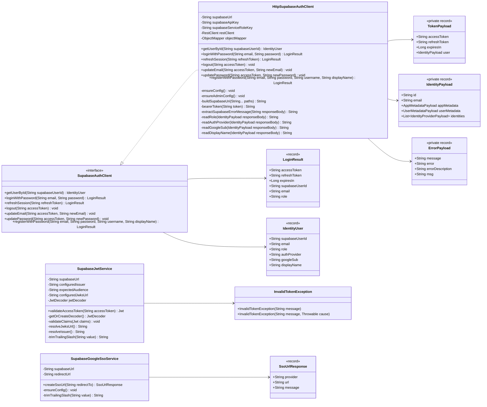

# Individual Component and Code Diagrams - BE-AUTH

Fokus diagram ini adalah container **Spring Boot Auth API**. External system seperti Supabase Auth, Supabase JWKS, dan Supabase Database hanya ditampilkan sebagai dependency keluar agar batas tanggung jawab component di dalam `be-auth` jelas.

## Notation

| Notasi                                | Arti                                                                    |
| ------------------------------------- | ----------------------------------------------------------------------- |
| Kotak di dalam `Spring Boot Auth API` | Component yang dimiliki oleh codebase `be-auth`.                        |
| Kotak di luar container               | External dependency atau actor di luar codebase.                        |
| Panah solid `-->`                     | Dependency langsung atau call langsung antar component/class.           |
| Panah dotted `-.->`                   | Relasi konfigurasi, exception handling, atau dependency tidak langsung. |
| `<<interface>>`                       | Java interface atau port.                                               |
| `<<record>>`                          | Java record DTO/value object.                                           |
| `<<enum>>`                            | Java enum.                                                              |
| `<<entity>>`                          | JPA entity.                                                             |

## Component Diagram

Diagram ini memperlihatkan struktur component di dalam container **Spring Boot Auth API** dan bagaimana component tersebut terhubung ke external dependency.

```mermaid
flowchart TB
  client["YOMU Frontend / API Client"]
  supabaseAuth["Supabase Auth API<br/>External identity provider"]
  supabaseJwks["Supabase JWKS Endpoint<br/>JWT public keys"]
  supabaseDb[("Supabase Database<br/>Managed PostgreSQL")]

  subgraph spring["Container: Spring Boot Auth API (Java 21, Spring Boot 3.5.10)"]
    subgraph http["HTTP API Layer"]
      authController["AuthController<br/>/api/auth<br/>me, login, register, refresh, logout,<br/>change-password, Google SSO URL"]
      userController["UserProfileController<br/>/api/users<br/>admin CRUD, lookup profiles,<br/>update current profile/email/phone,<br/>delete own account"]
      adminController["AdminController<br/>/api/admin<br/>admin ping"]
    end

    subgraph security["Security Layer"]
      securityConfig["SecurityConfig<br/>SecurityFilterChain, JwtDecoder,<br/>AuthenticationEntryPoint"]
      jwtFilter["SupabaseJwtAuthenticationFilter<br/>revocation check, yomu_user_id check,<br/>active-user check, role authority"]
      currentUser["CurrentUserProvider<br/>reads Jwt and AuthenticatedUserPrincipal<br/>from SecurityContext"]
      bearerExtractor["BearerTokenExtractor<br/>extracts access token from Authorization header"]
      unauthorizedWriter["UnauthorizedResponseWriter<br/>writes JSON 401 response"]
      principal["AuthenticatedUserPrincipal<br/>sub, email, role, publicUserId"]
    end

    subgraph authUseCases["Auth Use Case Layer"]
      loginService["AuthLoginService<br/>login, register, identifier resolution,<br/>profile sync after Supabase session"]
      sessionService["AuthSessionService<br/>refresh, logout, revoke token,<br/>change email, change password"]
      googleSso["SupabaseGoogleSsoService<br/>builds Google OAuth authorization URL"]
    end

    subgraph identityUseCases["Identity and Profile Layer"]
      profileService["UserProfileService<br/>admin profile CRUD, current-user profile update,<br/>phone/email uniqueness, active flag"]
      identitySync["UserProfileIdentitySyncService<br/>sync Supabase identity to local UserProfile,<br/>generate username, merge auth provider"]
    end

    subgraph sessionState["Session State Layer"]
      revocationService["TokenRevocationService<br/>hash token, revoke token,<br/>check revoked token"]
      revokedStore["RevokedTokenStore<br/>port for revoked token persistence"]
      jpaRevokedStore["JpaRevokedTokenStore<br/>JPA implementation,<br/>cleanup expired revoked tokens"]
    end

    subgraph supabaseBoundary["Supabase Integration Layer"]
      supabasePort["SupabaseAuthClient<br/>port/interface for identity provider"]
      httpSupabaseClient["HttpSupabaseAuthClient<br/>HTTP adapter for Supabase Auth<br/>login, refresh, logout, update credential,<br/>register, admin user lookup"]
      jwtService["SupabaseJwtService<br/>validates JWT signature, issuer,<br/>audience, and expiry"]
    end

    subgraph persistence["Persistence Layer"]
      userRepo["UserProfileRepository<br/>JpaRepository<UserProfile, UUID><br/>find by username/email/supabaseUserId/phone"]
      revokedRepo["RevokedAccessTokenRepository<br/>JpaRepository<RevokedAccessToken, String><br/>delete expired, exists by hash"]
    end

    subgraph domain["Domain Model Layer"]
      userEntity["UserProfile<br/>JPA entity: id, username, email,<br/>supabaseUserId, phone, authProvider,<br/>googleSub, displayName, role, active"]
      revokedEntity["RevokedAccessToken<br/>JPA entity: tokenHash, expiresAt"]
      roleEnum["Role<br/>enum: STUDENT, ADMIN<br/>canonicalize unknown role to STUDENT"]
    end

    subgraph dto["DTO Layer"]
      authRequests["AuthRequests<br/>LoginRequest, RegisterRequest,<br/>RefreshTokenRequest, ChangePasswordRequest"]
      authResponses["AuthResponses<br/>LoginResponse, LogoutResponse,<br/>MessageResponse, SsoUrlResponse, AdminPingResponse"]
      authMe["AuthMeResponse<br/>current authenticated user response"]
      userRequests["UserRequests<br/>UpdateEmailRequest, UpdatePhoneRequest,<br/>UpdateProfileRequest, LookupProfilesRequest,<br/>DeleteAccountRequest"]
      userResponses["UserResponses<br/>UpdateProfileResponse, LookupProfilesResponse,<br/>PublicUserProfileResponse, etc."]
      profileDto["UserProfileRequest / UserProfileResponse<br/>admin input and output DTO"]
    end

    subgraph errors["Exception and Error Layer"]
      globalHandler["GlobalExceptionHandler<br/>maps validation, conflict, unauthorized,<br/>data access, and runtime errors"]
      apiError["ApiErrorResponse<br/>standard error payload"]
      conflictEx["ConflictException<br/>business conflict"]
      unauthorizedEx["UnauthorizedException<br/>authentication/authorization failure"]
      commonResponses["CommonResponses.ErrorResponse<br/>simple error body used by AuthController.me"]
    end

    subgraph config["Support Configuration"]
      corsConfig["CorsConfig<br/>allowed frontend origins from FRONTEND_URL"]
      openApiConfig["OpenApiConfig<br/>Swagger bearer auth scheme"]
      timeConfig["TimeConfig<br/>Clock bean"]
      authApp["AuthApplication<br/>Spring Boot entry point"]
    end
  end

  client --> authController
  client --> userController
  client --> adminController

  securityConfig --> jwtFilter
  securityConfig --> jwtService
  securityConfig --> unauthorizedWriter
  securityConfig --> corsConfig

  jwtFilter --> revocationService
  jwtFilter --> currentUser
  jwtFilter --> profileService
  jwtFilter --> unauthorizedWriter
  jwtFilter --> roleEnum

  authController --> loginService
  authController --> sessionService
  authController --> googleSso
  authController --> profileService
  authController --> currentUser
  authController --> bearerExtractor
  authController --> authRequests
  authController --> authResponses
  authController --> authMe
  authController --> commonResponses

  userController --> profileService
  userController --> sessionService
  userController --> currentUser
  userController --> bearerExtractor
  userController --> userRequests
  userController --> userResponses
  userController --> profileDto

  adminController --> currentUser
  adminController --> authResponses

  currentUser --> principal
  currentUser --> roleEnum

  loginService --> supabasePort
  loginService --> profileService
  loginService --> jwtService
  loginService --> authResponses
  loginService --> conflictEx
  loginService --> unauthorizedEx
  loginService --> roleEnum

  sessionService --> supabasePort
  sessionService --> jwtService
  sessionService --> revocationService
  sessionService --> profileService
  sessionService --> authResponses
  sessionService --> unauthorizedEx
  sessionService --> roleEnum

  googleSso --> authResponses

  profileService --> identitySync
  profileService --> userRepo
  profileService --> userEntity
  profileService --> roleEnum
  profileService --> conflictEx

  identitySync --> userRepo
  identitySync --> supabasePort
  identitySync --> userEntity
  identitySync --> roleEnum
  identitySync --> conflictEx

  revocationService --> revokedStore
  revocationService --> timeConfig
  revokedStore --> jpaRevokedStore
  jpaRevokedStore --> revokedRepo
  revokedRepo --> revokedEntity

  supabasePort --> httpSupabaseClient
  httpSupabaseClient --> supabaseAuth
  jwtService --> supabaseJwks

  userRepo --> userEntity
  userEntity --> roleEnum
  userRepo --> supabaseDb
  revokedRepo --> supabaseDb

  globalHandler --> apiError
  globalHandler -.-> conflictEx
  globalHandler -.-> unauthorizedEx
  unauthorizedWriter --> apiError
```

### Component Responsibilities

| Component group            | Main classes                                                                                                                     | Responsibility                                                                                                                            |
| -------------------------- | -------------------------------------------------------------------------------------------------------------------------------- | ----------------------------------------------------------------------------------------------------------------------------------------- |
| HTTP API Layer             | `AuthController`, `UserProfileController`, `AdminController`                                                                     | Menerima request HTTP, melakukan binding DTO, memanggil service/use case, dan mengembalikan response.                                     |
| Security Layer             | `SecurityConfig`, `SupabaseJwtAuthenticationFilter`, `CurrentUserProvider`, `BearerTokenExtractor`, `UnauthorizedResponseWriter` | Mengatur public/protected endpoint, validasi JWT, cek token revoked, membaca current user, dan menulis response unauthorized.             |
| Auth Use Case Layer        | `AuthLoginService`, `AuthSessionService`, `SupabaseGoogleSsoService`                                                             | Mengorkestrasi login, register, refresh, logout, change email, change password, dan pembuatan URL Google SSO.                             |
| Identity and Profile Layer | `UserProfileService`, `UserProfileIdentitySyncService`                                                                           | Mengelola profile lokal, sinkronisasi data Supabase identity, admin CRUD, update current profile, validasi uniqueness, dan status active. |
| Session State Layer        | `TokenRevocationService`, `RevokedTokenStore`, `JpaRevokedTokenStore`                                                            | Menyimpan hash access token yang sudah logout agar token tidak bisa dipakai lagi sampai expired.                                          |
| Supabase Integration Layer | `SupabaseAuthClient`, `HttpSupabaseAuthClient`, `SupabaseJwtService`                                                             | Memisahkan port identity provider dari adapter HTTP Supabase dan validator JWT.                                                           |
| Persistence Layer          | `UserProfileRepository`, `RevokedAccessTokenRepository`                                                                          | Boundary ke Supabase Database lewat Spring Data JPA.                                                                                      |
| Domain Model Layer         | `UserProfile`, `RevokedAccessToken`, `Role`                                                                                      | Struktur data utama yang dipersist ke database dan aturan role dasar.                                                                     |
| DTO Layer                  | `AuthRequests`, `AuthResponses`, `AuthMeResponse`, `UserRequests`, `UserResponses`, `UserProfileRequest`, `UserProfileResponse`  | Kontrak input/output HTTP agar entity tidak langsung diekspos tanpa mapping.                                                              |
| Exception and Error Layer  | `GlobalExceptionHandler`, `ApiErrorResponse`, `ConflictException`, `UnauthorizedException`, `CommonResponses`                    | Mengubah exception menjadi response API yang dapat dipahami client.                                                                       |
| Support Configuration      | `CorsConfig`, `OpenApiConfig`, `TimeConfig`, `AuthApplication`                                                                   | Konfigurasi aplikasi, CORS, Swagger, dan waktu.                                                                                           |

### Main Dependency Flow

Alur dependency utama sengaja dibuat searah:

1. `Controller` menerima request lalu memanggil `Service`.
2. `Service` menjalankan use case dan memakai port seperti `SupabaseAuthClient` atau repository.
3. `SupabaseAuthClient` diimplementasikan oleh `HttpSupabaseAuthClient` untuk memanggil Supabase Auth.
4. Repository memakai JPA untuk membaca/menulis ke Supabase Database.
5. Security filter berjalan sebelum controller pada endpoint protected dan memberi role authority ke Spring Security.

Dependency yang paling penting:

- `AuthController -> AuthLoginService -> SupabaseAuthClient -> HttpSupabaseAuthClient -> Supabase Auth`
- `AuthController -> AuthSessionService -> TokenRevocationService -> RevokedTokenStore -> Supabase Database`
- `SupabaseJwtAuthenticationFilter -> CurrentUserProvider -> UserProfileService -> UserProfileRepository -> Supabase Database`
- `UserProfileController -> UserProfileService -> UserProfileIdentitySyncService -> SupabaseAuthClient`

## Code Diagram 1 - Authentication Login and Register

Diagram ini memperlihatkan class-level structure untuk flow login dan register.

```mermaid
classDiagram
  direction LR

  class AuthController {
    -AuthLoginService authLoginService
    -AuthSessionService authSessionService
    -SupabaseGoogleSsoService googleSsoService
    -UserProfileService userProfileService
    -CurrentUserProvider currentUserProvider
    -boolean passwordAuthEnabled
    +login(LoginRequest request) ResponseEntity~LoginResponse~
    +register(RegisterRequest request) ResponseEntity~LoginResponse~
    -ensurePasswordAuthEnabled() void
  }

  class LoginRequest {
    <<record>>
    +String identifier
    +String password
  }

  class RegisterRequest {
    <<record>>
    +String email
    +String phone
    +String password
    +String username
    +String displayName
  }

  class LoginResponse {
    <<record>>
    +String accessToken
    +String refreshToken
    +String tokenType
    +Long expiresIn
    +String userId
    +String role
    +String message
  }

  class AuthLoginService {
    -SupabaseAuthClient supabaseAuthClient
    -UserProfileService userProfileService
    -SupabaseJwtService supabaseJwtService
    +login(String identifier, String password) LoginResponse
    +register(String email, String phone, String password, String username, String displayName) LoginResponse
    -resolveEmailIdentifier(String identifier) String
    -ensureAccountActive(String email) void
    -normalizePhoneIdentifier(String identifier) String
    -normalizeRegistrationEmail(String email) String
    -normalizeRegistrationPhone(String phone) String
    -ensureRegistrationIdentityAvailable(String email, String phone) void
    -ensurePublicUserIdClaim(LoginResult session) LoginResult
  }

  class SupabaseAuthClient {
    <<interface>>
    +loginWithPassword(String email, String password) LoginResult
    +registerWithPassword(String email, String password, String username, String displayName) LoginResult
    +refreshSession(String refreshToken) LoginResult
  }

  class LoginResult {
    <<record>>
    +String accessToken
    +String refreshToken
    +Long expiresIn
    +String supabaseUserId
    +String email
    +String role
  }

  class HttpSupabaseAuthClient {
    -String supabaseUrl
    -String supabaseApiKey
    -String supabaseServiceRoleKey
    -RestClient restClient
    -ObjectMapper objectMapper
    +loginWithPassword(String email, String password) LoginResult
    +registerWithPassword(String email, String password, String username, String displayName) LoginResult
    +refreshSession(String refreshToken) LoginResult
    -ensureConfig() void
    -extractSupabaseErrorMessage(String responseBody) String
    -readRole(IdentityPayload user) String
  }

  class SupabaseJwtService {
    -String supabaseUrl
    -String configuredIssuer
    -String expectedAudience
    -String configuredJwksUrl
    -JwtDecoder jwtDecoder
    +validateAccessToken(String accessToken) Jwt
    -validateClaims(Jwt claims) void
    -resolveJwksUrl() String
    -resolveIssuer() String
  }

  class UserProfileService {
    -UserProfileRepository repository
    -UserProfileIdentitySyncService identitySyncService
    +findByEmail(String email) Optional~UserProfile~
    +findByPhone(String phone) Optional~UserProfile~
    +findByUsername(String username) Optional~UserProfile~
    +upsertFromIdentity(String supabaseUserId, String email, String incomingRole) UserProfile
    +updateIdentityProfile(String supabaseUserId, String email, String username, String displayName, String phone) UserProfile
  }

  class UserProfileIdentitySyncService {
    -UserProfileRepository repository
    -SupabaseAuthClient supabaseAuthClient
    +upsertFromIdentity(String supabaseUserId, String email, String incomingRole) UserProfile
    +upsertFromIdentity(String supabaseUserId, String email, String incomingRole, String authProvider, String googleSub, String displayName) UserProfile
    -generateUniqueUsername(String email, String supabaseUserId) String
    -mergeAuthProvider(String currentValue, String nextValue) String
  }

  class UserProfileRepository {
    <<interface>>
    +findByEmail(String email) Optional~UserProfile~
    +findByPhone(String phone) Optional~UserProfile~
    +findByUsername(String username) Optional~UserProfile~
    +findBySupabaseUserId(String supabaseUserId) Optional~UserProfile~
    +existsByEmail(String email) boolean
    +existsByPhone(String phone) boolean
    +existsByUsername(String username) boolean
    +save(UserProfile user) UserProfile
  }

  class UserProfile {
    <<entity>>
    -UUID id
    -String username
    -String email
    -String supabaseUserId
    -String phone
    -String authProvider
    -String googleSub
    -String displayName
    -Role role
    -boolean active
  }

  class Role {
    <<enum>>
    STUDENT
    ADMIN
    +from(String incomingRole) Role
    +canonicalize(String incomingRole) String
  }

  AuthController --> LoginRequest
  AuthController --> RegisterRequest
  AuthController --> LoginResponse
  AuthController --> AuthLoginService
  AuthLoginService --> SupabaseAuthClient
  SupabaseAuthClient <|.. HttpSupabaseAuthClient
  SupabaseAuthClient --> LoginResult
  AuthLoginService --> SupabaseJwtService
  AuthLoginService --> UserProfileService
  AuthLoginService --> Role
  UserProfileService --> UserProfileIdentitySyncService
  UserProfileService --> UserProfileRepository
  UserProfileIdentitySyncService --> UserProfileRepository
  UserProfileRepository --> UserProfile
  UserProfile --> Role
```

### Explanation

Flow `login`:

1. `AuthController.login()` menerima `LoginRequest`.
2. `AuthController` memanggil `ensurePasswordAuthEnabled()` agar password auth bisa dimatikan lewat konfigurasi `AUTH_PASSWORD_ENABLED`.
3. `AuthLoginService.login()` menjalankan `resolveEmailIdentifier()`:
   - Jika identifier mengandung `@`, identifier dianggap email.
   - Jika identifier berbentuk nomor telepon, service mencari user lewat `UserProfileService.findByPhone()`.
   - Jika bukan email/phone, service mencari user lewat `UserProfileService.findByUsername()`.
4. `AuthLoginService.ensureAccountActive()` memastikan account lokal yang ditemukan tidak deactivated.
5. `SupabaseAuthClient.loginWithPassword()` dipanggil. Implementasi konkretnya adalah `HttpSupabaseAuthClient`, yang memanggil Supabase Auth API.
6. Setelah Supabase mengembalikan session, `UserProfileService.upsertFromIdentity()` memastikan data lokal di table `users` sinkron dengan identity Supabase.
7. `ensurePublicUserIdClaim()` memvalidasi access token melalui `SupabaseJwtService`; jika claim `yomu_user_id` belum ada, session di-refresh lewat Supabase.
8. Response dikembalikan sebagai `LoginResponse`.

Flow `register`:

1. `AuthController.register()` menerima `RegisterRequest`.
2. `AuthLoginService.register()` menormalisasi email dan phone.
3. `ensureRegistrationIdentityAvailable()` mengecek uniqueness email dan phone pada `UserProfileService`.
4. `SupabaseAuthClient.registerWithPassword()` mendaftarkan identity ke Supabase.
5. `UserProfileService.upsertFromIdentity()` membuat/memperbarui profile lokal berdasarkan Supabase identity.
6. `UserProfileService.updateIdentityProfile()` melengkapi username, display name, dan phone.
7. Jika database sedang bermasalah, service tetap bisa mengembalikan token Supabase dengan pesan `Profile sync pending`.

### Why This Code Diagram Matters

Diagram ini menunjukkan bahwa `AuthLoginService` adalah orchestration point untuk auth berbasis password. Kelas ini tidak langsung tahu detail HTTP Supabase karena bergantung pada interface `SupabaseAuthClient`, sehingga unit test bisa memakai mock/fake client. Boundary pentingnya adalah:

- `AuthController` = HTTP binding.
- `AuthLoginService` = business/use-case orchestration.
- `SupabaseAuthClient` = port ke identity provider.
- `HttpSupabaseAuthClient` = adapter HTTP Supabase.
- `UserProfileService` = sinkronisasi profile lokal.

## Code Diagram 2 - Protected Request and JWT Security

Diagram ini memperlihatkan class-level structure untuk request yang membawa Bearer token.

```mermaid
classDiagram
  direction LR

  class SecurityConfig {
    +supabaseJwtAuthenticationFilter(TokenRevocationService, UserProfileService, CurrentUserProvider, ObjectMapper) SupabaseJwtAuthenticationFilter
    +jwtDecoder(SupabaseJwtService) JwtDecoder
    +authenticationEntryPoint(ObjectMapper) AuthenticationEntryPoint
    +securityFilterChain(HttpSecurity, SupabaseJwtAuthenticationFilter, AuthenticationEntryPoint) SecurityFilterChain
  }

  class SupabaseJwtService {
    +validateAccessToken(String accessToken) Jwt
    -getOrCreateDecoder() JwtDecoder
    -validateClaims(Jwt claims) void
    -resolveJwksUrl() String
    -resolveIssuer() String
  }

  class SupabaseJwtAuthenticationFilter {
    -TokenRevocationService tokenRevocationService
    -UserProfileService userProfileService
    -CurrentUserProvider currentUserProvider
    -ObjectMapper objectMapper
    +shouldNotFilter(HttpServletRequest request) boolean
    +doFilterInternal(HttpServletRequest request, HttpServletResponse response, FilterChain filterChain) void
    -resolveRole(Optional~UserProfile~ profile, String tokenRole) String
    -buildAuthorities(String role) List~GrantedAuthority~
    -writeServiceUnavailable(HttpServletRequest request, HttpServletResponse response) void
  }

  class TokenRevocationService {
    -RevokedTokenStore revokedTokenStore
    -Clock clock
    +revoke(String accessToken, Instant expiresAt) void
    +isRevoked(String accessToken) boolean
    -hash(String accessToken) String
  }

  class RevokedTokenStore {
    <<interface>>
    +save(String tokenHash, Instant expiresAt, Instant now) void
    +exists(String tokenHash, Instant now) boolean
  }

  class JpaRevokedTokenStore {
    -RevokedAccessTokenRepository repository
    +save(String tokenHash, Instant expiresAt, Instant now) void
    +exists(String tokenHash, Instant now) boolean
  }

  class RevokedAccessTokenRepository {
    <<interface>>
    +deleteAllByExpiresAtLessThanEqual(Instant expiresAt) void
    +existsByTokenHashAndExpiresAtAfter(String tokenHash, Instant expiresAt) boolean
  }

  class CurrentUserProvider {
    +getCurrentJwt() Optional~Jwt~
    +getCurrentUser() Optional~AuthenticatedUserPrincipal~
    +requireCurrentUser() AuthenticatedUserPrincipal
    +requireCurrentPublicUserId() String
    -resolvePublicUserId(Jwt jwt) String
  }

  class AuthenticatedUserPrincipal {
    <<record>>
    +String sub
    +String email
    +String role
    +String publicUserId
  }

  class UserProfileService {
    +findByPublicUserId(String publicUserId) Optional~UserProfile~
  }

  class UserProfile {
    <<entity>>
    +getRole() String
    +isActive() boolean
  }

  class Role {
    <<enum>>
    +canonicalize(String incomingRole) String
  }

  class UnauthorizedResponseWriter {
    +write(ObjectMapper objectMapper, HttpServletRequest request, HttpServletResponse response, String message) void
  }

  class ApiErrorResponse {
    <<record>>
    +Instant timestamp
    +int status
    +String error
    +String message
    +String path
    +Map details
  }

  SecurityConfig --> SupabaseJwtService
  SecurityConfig --> SupabaseJwtAuthenticationFilter
  SecurityConfig --> UnauthorizedResponseWriter
  SupabaseJwtAuthenticationFilter --> TokenRevocationService
  SupabaseJwtAuthenticationFilter --> CurrentUserProvider
  SupabaseJwtAuthenticationFilter --> UserProfileService
  SupabaseJwtAuthenticationFilter --> UnauthorizedResponseWriter
  SupabaseJwtAuthenticationFilter --> Role
  TokenRevocationService --> RevokedTokenStore
  RevokedTokenStore <|.. JpaRevokedTokenStore
  JpaRevokedTokenStore --> RevokedAccessTokenRepository
  CurrentUserProvider --> AuthenticatedUserPrincipal
  CurrentUserProvider --> Role
  UserProfileService --> UserProfile
  UserProfile --> Role
  UnauthorizedResponseWriter --> ApiErrorResponse
```

### Explanation

Flow protected request:

1. Request masuk dengan header `Authorization: Bearer <token>`.
2. Spring Security Resource Server memvalidasi JWT memakai `JwtDecoder` dari `SecurityConfig`.
3. `JwtDecoder` delegasi ke `SupabaseJwtService.validateAccessToken()`:
   - mengambil JWKS dari Supabase,
   - memvalidasi signature,
   - memvalidasi expiry,
   - memvalidasi issuer,
   - memvalidasi audience.
4. Setelah JWT valid, `SupabaseJwtAuthenticationFilter` berjalan.
5. Filter melewati endpoint public seperti login, register, refresh, dan Google SSO URL.
6. Untuk endpoint protected, filter:
   - memastikan token belum revoked lewat `TokenRevocationService.isRevoked()`,
   - mengambil JWT/current user lewat `CurrentUserProvider`,
   - mengambil claim `yomu_user_id`,
   - lookup `UserProfile` lokal lewat `UserProfileService.findByPublicUserId()`,
   - menolak request jika user inactive,
   - menentukan role dari profile lokal atau claim token,
   - memasang authority `ROLE_STUDENT` atau `ROLE_ADMIN`.
7. Jika gagal auth, `UnauthorizedResponseWriter` menulis response JSON 401.
8. Jika database tidak tersedia saat lookup profile, filter mengembalikan 503.

### Endpoint Security Rules

Aturan utama di `SecurityConfig`:

| Endpoint                       | Rule          |
| ------------------------------ | ------------- |
| `POST /api/auth/login`         | public        |
| `POST /api/auth/register`      | public        |
| `POST /api/auth/refresh`       | public        |
| `GET /api/auth/sso/google/url` | public        |
| `PATCH /api/users/me`          | authenticated |
| `PATCH /api/users/me/email`    | authenticated |
| `PATCH /api/users/me/phone`    | authenticated |
| `DELETE /api/users/me`         | authenticated |
| `POST /api/users/lookup`       | authenticated |
| `/api/users/**`                | `ROLE_ADMIN`  |
| `/api/admin/**`                | `ROLE_ADMIN`  |
| `/api/**`                      | authenticated |

### Why This Code Diagram Matters

Diagram ini menjelaskan boundary keamanan utama: validasi token bukan hanya signature JWT, tetapi juga revocation check dan lookup user lokal. Ini penting karena:

- Token Supabase yang masih valid bisa ditolak jika sudah logout dan hash-nya ada di `revoked_access_tokens`.
- User yang sudah deactivated akan ditolak walaupun JWT-nya belum expired.
- Role authority yang dipakai controller/admin endpoint berasal dari profile lokal jika tersedia.

## Code Diagram 3 - Session, Logout, Change Email, and Change Password

Diagram ini memperlihatkan class-level structure untuk operasi session dan credential setelah user authenticated.

```mermaid
classDiagram
  direction LR

  class AuthController {
    +refresh(RefreshTokenRequest request) ResponseEntity~LoginResponse~
    +logout(HttpServletRequest request) ResponseEntity~LogoutResponse~
    +changePassword(ChangePasswordRequest request, HttpServletRequest httpRequest) ResponseEntity~MessageResponse~
  }

  class UserProfileController {
    +updateEmail(UpdateEmailRequest request, HttpServletRequest httpRequest) ResponseEntity~UpdateEmailResponse~
    +deleteMe(DeleteAccountRequest request, HttpServletRequest httpRequest) ResponseEntity~DeleteAccountResponse~
  }

  class BearerTokenExtractor {
    +extractOrUnauthorized(HttpServletRequest request) String
    +extractOrBadRequest(HttpServletRequest request) String
    -extract(HttpServletRequest request) String
  }

  class CurrentUserProvider {
    +requireCurrentUser() AuthenticatedUserPrincipal
  }

  class AuthenticatedUserPrincipal {
    <<record>>
    +String sub
    +String email
    +String role
    +String publicUserId
  }

  class AuthSessionService {
    -SupabaseAuthClient supabaseAuthClient
    -SupabaseJwtService supabaseJwtService
    -TokenRevocationService tokenRevocationService
    -UserProfileService userProfileService
    +refresh(String refreshToken) LoginResponse
    +logout(String accessToken) void
    +revokeCurrentAccessToken(String accessToken) void
    +changeEmail(String accessToken, String publicUserId, String currentEmail, String newEmail) UserProfile
    +changePassword(String accessToken, String publicUserId, String supabaseUserId, String email, String currentPassword, String newPassword) void
    -supportsPasswordAuth(UserProfile profile) boolean
    -supportsGoogleOnlyPasswordSetup(UserProfile profile, String supabaseUserId) boolean
    -containsProvider(String authProvider, String provider) boolean
  }

  class SupabaseAuthClient {
    <<interface>>
    +refreshSession(String refreshToken) LoginResult
    +logout(String accessToken) void
    +updateEmail(String accessToken, String newEmail) void
    +updatePassword(String accessToken, String newPassword) void
    +loginWithPassword(String email, String password) LoginResult
  }

  class SupabaseJwtService {
    +validateAccessToken(String accessToken) Jwt
  }

  class TokenRevocationService {
    +revoke(String accessToken, Instant expiresAt) void
    +isRevoked(String accessToken) boolean
    -hash(String accessToken) String
  }

  class UserProfileService {
    +upsertFromIdentity(String supabaseUserId, String email, String incomingRole) UserProfile
    +findByPublicUserId(String publicUserId) Optional~UserProfile~
    +updateCurrentUserEmail(String publicUserId, String newEmail) UserProfile
    +markCurrentUserPasswordEnabled(String publicUserId) UserProfile
    +deactivateCurrentUser(String publicUserId) UserProfile
  }

  class UserProfile {
    <<entity>>
    +getId() UUID
    +getEmail() String
    +getRole() String
    +getAuthProvider() String
    +getGoogleSub() String
    +getSupabaseUserId() String
  }

  class LoginResponse {
    <<record>>
  }

  class LogoutResponse {
    <<record>>
  }

  class MessageResponse {
    <<record>>
  }

  class UpdateEmailResponse {
    <<record>>
  }

  class DeleteAccountResponse {
    <<record>>
  }

  AuthController --> AuthSessionService
  AuthController --> BearerTokenExtractor
  AuthController --> CurrentUserProvider
  AuthController --> LoginResponse
  AuthController --> LogoutResponse
  AuthController --> MessageResponse

  UserProfileController --> AuthSessionService
  UserProfileController --> UserProfileService
  UserProfileController --> BearerTokenExtractor
  UserProfileController --> CurrentUserProvider
  UserProfileController --> UpdateEmailResponse
  UserProfileController --> DeleteAccountResponse

  CurrentUserProvider --> AuthenticatedUserPrincipal
  AuthSessionService --> SupabaseAuthClient
  AuthSessionService --> SupabaseJwtService
  AuthSessionService --> TokenRevocationService
  AuthSessionService --> UserProfileService
  AuthSessionService --> LoginResponse
  AuthSessionService --> UserProfile
  UserProfileService --> UserProfile
```

### Explanation

Flow `refresh`:

1. `AuthController.refresh()` menerima `RefreshTokenRequest`.
2. `AuthSessionService.refresh()` memanggil `SupabaseAuthClient.refreshSession()`.
3. Profile lokal di-upsert lewat `UserProfileService.upsertFromIdentity()`.
4. Response dikembalikan sebagai `LoginResponse`.

Flow `logout`:

1. `AuthController.logout()` mengambil access token dari header memakai `BearerTokenExtractor.extractOrUnauthorized()`.
2. `AuthSessionService.logout()` memvalidasi access token lewat `SupabaseJwtService`.
3. `TokenRevocationService.revoke()` menyimpan hash token beserta expiry token.
4. `SupabaseAuthClient.logout()` memanggil Supabase Auth logout endpoint.
5. Token yang sudah revoked akan ditolak oleh `SupabaseJwtAuthenticationFilter` pada request berikutnya.

Flow `changeEmail`:

1. `UserProfileController.updateEmail()` membaca current user dari `CurrentUserProvider`.
2. Access token diambil memakai `BearerTokenExtractor.extractOrBadRequest()`.
3. `AuthSessionService.changeEmail()` mengubah email lokal melalui `UserProfileService.updateCurrentUserEmail()`.
4. Setelah local update berhasil, service memanggil `SupabaseAuthClient.updateEmail()`.
5. Jika Supabase update gagal, service melakukan rollback manual ke email lama.

Flow `changePassword`:

1. `AuthController.changePassword()` membaca current user dan access token.
2. `AuthSessionService.changePassword()` mengambil profile lokal.
3. Jika profile mendukung password auth, current password diverifikasi dengan `SupabaseAuthClient.loginWithPassword()`.
4. Jika account Google-only tetapi eligible untuk membuat password, service mengizinkan update password.
5. Password diubah lewat `SupabaseAuthClient.updatePassword()`.
6. Jika user sebelumnya Google-only, `UserProfileService.markCurrentUserPasswordEnabled()` menandai provider lokal mendukung password.

### Why This Code Diagram Matters

Diagram ini menunjukkan bahwa session management punya dua state:

- State eksternal di Supabase Auth, misalnya refresh token, logout, email, dan password.
- State lokal di Supabase Database, misalnya profile email, active flag, auth provider, dan revoked token hash.

Karena ada dua state, operasi seperti `changeEmail` perlu memperhatikan consistency. Kode saat ini melakukan local update dulu, external update setelah itu, lalu rollback manual jika external update gagal.

## Code Diagram 4 - User Profile and Admin Management

Diagram ini memperlihatkan class-level structure untuk profile user, admin CRUD, lookup public profiles, dan sync identity dari Supabase.

```mermaid
classDiagram
  direction LR

  class UserProfileController {
    -UserProfileService service
    -AuthSessionService authSessionService
    -CurrentUserProvider currentUserProvider
    +create(UserProfileRequest request) ResponseEntity~UserProfileResponse~
    +all() List~UserProfileResponse~
    +lookupProfiles(LookupProfilesRequest request) ResponseEntity~LookupProfilesResponse~
    +getById(UUID id) ResponseEntity~UserProfileResponse~
    +update(UUID id, UserProfileRequest request) ResponseEntity~UserProfileResponse~
    +delete(UUID id) ResponseEntity~Void~
    +activate(UUID id) ResponseEntity~UserProfileResponse~
    +updateMe(UpdateProfileRequest request) ResponseEntity~UpdateProfileResponse~
    +updatePhone(UpdatePhoneRequest request) ResponseEntity~UpdatePhoneResponse~
    +deleteMe(DeleteAccountRequest request, HttpServletRequest httpRequest) ResponseEntity~DeleteAccountResponse~
    -toEntity(UserProfileRequest request) UserProfile
  }

  class AdminController {
    -CurrentUserProvider currentUserProvider
    +ping() ResponseEntity~AdminPingResponse~
  }

  class UserProfileService {
    -UserProfileRepository repository
    -UserProfileIdentitySyncService identitySyncService
    +create(UserProfile user) UserProfile
    +findAll() List~UserProfile~
    +findById(UUID id) Optional~UserProfile~
    +findPublicProfilesByIds(List~UUID~ userIds) List~UserProfile~
    +findByPublicUserId(String publicUserId) Optional~UserProfile~
    +findByEmail(String email) Optional~UserProfile~
    +findByUsername(String username) Optional~UserProfile~
    +findByPhone(String phone) Optional~UserProfile~
    +update(UUID id, UserProfile incoming) Optional~UserProfile~
    +deactivateById(UUID id) UserProfile
    +activateById(UUID id) UserProfile
    +updateCurrentUserProfile(String publicUserId, String username, String displayName) UserProfile
    +updateCurrentUserPhone(String publicUserId, String newPhone) UserProfile
    +deactivateCurrentUser(String publicUserId) UserProfile
    +updateIdentityProfile(String supabaseUserId, String email, String username, String displayName, String phone) UserProfile
    -normalizePhone(String phone) Optional~String~
    -validateUnique(String currentValue, String newValue, Predicate existsCheck, String conflictMessage) void
    -mergeAuthProvider(String currentValue, String nextProvider) String
  }

  class UserProfileIdentitySyncService {
    -UserProfileRepository repository
    -SupabaseAuthClient supabaseAuthClient
    +upsertFromIdentity(String supabaseUserId, String email, String incomingRole) UserProfile
    +syncAdminUpdate(UserProfile existing, UserProfile incoming) UserProfile
    -generateUniqueUsername(String email, String supabaseUserId) String
    -sanitizeUsernameCandidate(String email) String
    -applyIdentityEnrichment(UserProfile user, String authProvider, String googleSub, String displayName) void
    -resolveAuthProvider(String authProvider) String
    -mergeAuthProvider(String currentValue, String nextValue) String
  }

  class SupabaseAuthClient {
    <<interface>>
    +getUserById(String supabaseUserId) IdentityUser
  }

  class IdentityUser {
    <<record>>
    +String supabaseUserId
    +String email
    +String role
    +String authProvider
    +String googleSub
    +String displayName
  }

  class UserProfileRepository {
    <<interface>>
    +findByUsername(String username) Optional~UserProfile~
    +findByEmail(String email) Optional~UserProfile~
    +findBySupabaseUserId(String supabaseUserId) Optional~UserProfile~
    +findByPhone(String phone) Optional~UserProfile~
    +existsByUsername(String username) boolean
    +existsByEmail(String email) boolean
    +existsByPhone(String phone) boolean
    +findAllById(Iterable~UUID~ ids) List~UserProfile~
    +save(UserProfile userProfile) UserProfile
  }

  class UserProfile {
    <<entity>>
    -UUID id
    -String username
    -String email
    -String supabaseUserId
    -String phone
    -String authProvider
    -String googleSub
    -String displayName
    -Role role
    -boolean active
    -LocalDateTime createdAt
    -LocalDateTime updatedAt
    +getRole() String
    +setRole(String role) void
    +getRoleEnum() Role
  }

  class Role {
    <<enum>>
    STUDENT
    ADMIN
    +from(String incomingRole) Role
    +canonicalize(String incomingRole) String
  }

  class UserProfileRequest {
    +String username
    +String email
    +String supabaseUserId
    +String displayName
    +String role
    +Boolean active
  }

  class UserProfileResponse {
    <<record>>
    +UUID id
    +String username
    +String email
    +String supabaseUserId
    +String phone
    +String authProvider
    +String googleSub
    +String displayName
    +String role
    +boolean active
    +from(UserProfile user) UserProfileResponse
  }

  class PublicUserProfileResponse {
    <<record>>
  }

  class LookupProfilesResponse {
    <<record>>
  }

  class UpdateProfileResponse {
    <<record>>
  }

  class UpdatePhoneResponse {
    <<record>>
  }

  class DeleteAccountResponse {
    <<record>>
  }

  UserProfileController --> UserProfileService
  UserProfileController --> AuthSessionService
  UserProfileController --> CurrentUserProvider
  UserProfileController --> UserProfileRequest
  UserProfileController --> UserProfileResponse
  UserProfileController --> PublicUserProfileResponse
  UserProfileController --> LookupProfilesResponse
  UserProfileController --> UpdateProfileResponse
  UserProfileController --> UpdatePhoneResponse
  UserProfileController --> DeleteAccountResponse

  AdminController --> CurrentUserProvider

  UserProfileService --> UserProfileIdentitySyncService
  UserProfileService --> UserProfileRepository
  UserProfileService --> UserProfile
  UserProfileService --> Role

  UserProfileIdentitySyncService --> UserProfileRepository
  UserProfileIdentitySyncService --> SupabaseAuthClient
  SupabaseAuthClient --> IdentityUser

  UserProfileRepository --> UserProfile
  UserProfile --> Role
```

### Explanation

Admin profile management:

1. Admin endpoints di `UserProfileController` menangani create, list, get by id, update, deactivate, dan activate.
2. `UserProfileController.toEntity()` mengubah `UserProfileRequest` menjadi `UserProfile`.
3. `UserProfileService.create()` memanggil `UserProfileIdentitySyncService.syncAdminUpdate()`.
4. Jika request memiliki `supabaseUserId`, `UserProfileIdentitySyncService` mengambil identity dari Supabase melalui `SupabaseAuthClient.getUserById()`.
5. Data identity Supabase dipakai untuk mengisi `supabaseUserId`, `email`, `authProvider`, `googleSub`, dan `displayName`.
6. Field admin-managed seperti `username`, `displayName`, `role`, dan `active` diterapkan oleh `UserProfileService`.
7. Entity disimpan lewat `UserProfileRepository`.

Current user profile management:

1. Endpoint `/api/users/me` memakai `CurrentUserProvider.requireCurrentUser()` untuk mendapatkan `publicUserId`.
2. `UserProfileService.updateCurrentUserProfile()` mengubah username atau display name.
3. `UserProfileService.updateCurrentUserPhone()` menormalisasi nomor telepon dan memvalidasi uniqueness.
4. `UserProfileService.deactivateCurrentUser()` mengubah `active=false`, lalu controller memanggil `AuthSessionService.logout()` agar token current user direvoke.

Lookup public profiles:

1. `UserProfileController.lookupProfiles()` menerima daftar UUID.
2. `UserProfileService.findPublicProfilesByIds()` menghapus duplicate ID dan mengambil data dengan `repository.findAllById()`.
3. Hasil dimapping ke `PublicUserProfileResponse`.

### Data Model Notes

`UserProfile` adalah entity utama untuk profile lokal:

| Field            | Purpose                                                              |
| ---------------- | -------------------------------------------------------------------- |
| `id`             | Public user id lokal yang dipakai juga sebagai claim `yomu_user_id`. |
| `username`       | Unique username untuk login identifier dan profile.                  |
| `email`          | Unique email, disinkronkan dengan Supabase identity.                 |
| `supabaseUserId` | ID identity di Supabase Auth.                                        |
| `phone`          | Unique phone number setelah normalisasi.                             |
| `authProvider`   | Provider login, misalnya `PASSWORD`, `GOOGLE`, atau gabungan.        |
| `googleSub`      | Google subject id jika user memakai Google SSO.                      |
| `displayName`    | Nama tampilan user.                                                  |
| `role`           | `STUDENT` atau `ADMIN`.                                              |
| `active`         | Menentukan apakah account masih boleh mengakses protected endpoint.  |

### Why This Code Diagram Matters

Diagram ini menunjukkan bahwa profile bukan hanya data tambahan, tetapi bagian dari security model:

- `active=false` membuat user ditolak oleh security filter.
- `role` menentukan akses admin.
- `id` menjadi public user id yang harus ada pada claim `yomu_user_id`.
- `authProvider` menentukan apakah user boleh change password langsung atau perlu flow setup password.

## Code Diagram 5 - Supabase Adapter and JWT Validation

Diagram ini memperlihatkan detail boundary antara kode internal `be-auth` dan Supabase.

### Explanation

Supabase Auth adapter:

1. Internal service seperti `AuthLoginService`, `AuthSessionService`, dan `UserProfileIdentitySyncService` bergantung pada `SupabaseAuthClient`.
2. Implementasi konkretnya adalah `HttpSupabaseAuthClient`.
3. `HttpSupabaseAuthClient` menyimpan config:
   - `supabase.url`,
   - `supabase.api-key`,
   - `supabase.service-role-key`.
4. Adapter menggunakan `RestClient` untuk endpoint Supabase:
   - password login,
   - refresh token,
   - logout,
   - update email,
   - update password,
   - register password,
   - admin get user by id.
5. Response Supabase dimapping ke record internal `LoginResult` atau `IdentityUser`.
6. Error Supabase diparse dari `ErrorPayload` lalu dilempar sebagai exception domain/API yang lebih sesuai.

JWT validation:

1. `SecurityConfig.jwtDecoder()` membungkus `SupabaseJwtService.validateAccessToken()`.
2. `SupabaseJwtService` membuat `NimbusJwtDecoder` dari JWKS URL Supabase.
3. JWT dianggap valid jika:
   - signature valid,
   - token belum expired,
   - issuer cocok,
   - audience mengandung expected audience.
4. Jika gagal, `InvalidTokenException` dilempar dan diterjemahkan menjadi `BadJwtException` oleh Spring Security.

Google SSO URL:

1. `SupabaseGoogleSsoService.createSsoUrl()` membangun URL `supabaseUrl + /auth/v1/authorize`.
2. Query param yang dipakai:
   - `provider=google`,
   - `redirect_to=<targetRedirectUrl>`.
3. Target redirect default berasal dari `auth.sso.google.redirect-url`.
4. Jika parameter `redirectTo` dikirim, kode saat ini menerima URL yang diawali `http://` atau `https://`.

### Why This Code Diagram Matters

Diagram ini memperjelas bahwa Supabase integration adalah boundary eksternal paling penting di `be-auth`. Dengan adanya interface `SupabaseAuthClient`, business service tidak perlu tahu detail HTTP request Supabase. Namun adapter `HttpSupabaseAuthClient` cukup besar karena mengurus HTTP call, payload mapping, metadata extraction, dan error mapping sekaligus.

## Summary

Component diagram menunjukkan bahwa `be-auth` memakai layered architecture dengan sedikit gaya ports-and-adapters pada integrasi Supabase. Code diagrams memperjelas area kerja utama:

1. Authentication login/register.
2. Protected request dan JWT security.
3. Session/logout/change credential.
4. User profile dan admin management.
5. Supabase adapter dan JWT validation.

Bagian paling penting dari arsitektur ini adalah boundary antara controller, use case service, Supabase port/adapter, security filter, repository, dan entity. Boundary tersebut membuat kode relatif mudah dites dan dipahami, tetapi ada beberapa component yang besar dan sangat sentral seperti `AuthLoginService`, `UserProfileService`, `HttpSupabaseAuthClient`, dan `SupabaseJwtAuthenticationFilter`.
